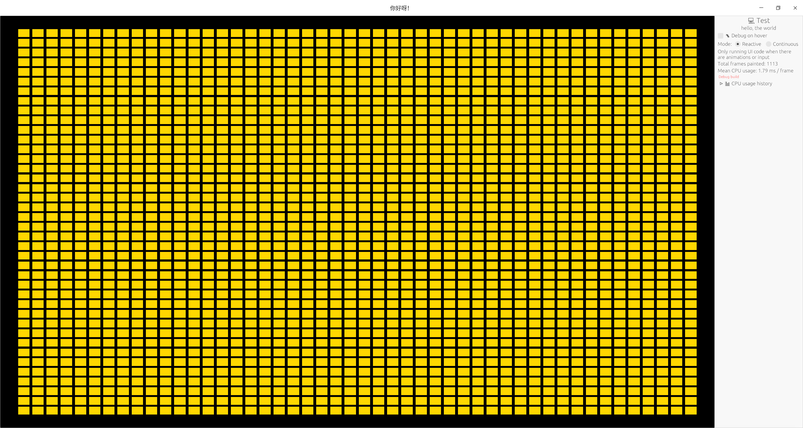

## 实现最基本的工具软件的功能

最大化, 最小化, 全屏

菜单, 右键菜单

应用图标

待实现: 1. 持久化存储, 2. 窗口边沿调节尺寸 3. 方便添加定制主题

```sh
cargo run -p test-bevy-egui
```


## egui 的简单demo

```sh
cargo run -p test-egui --example test_shape
```


